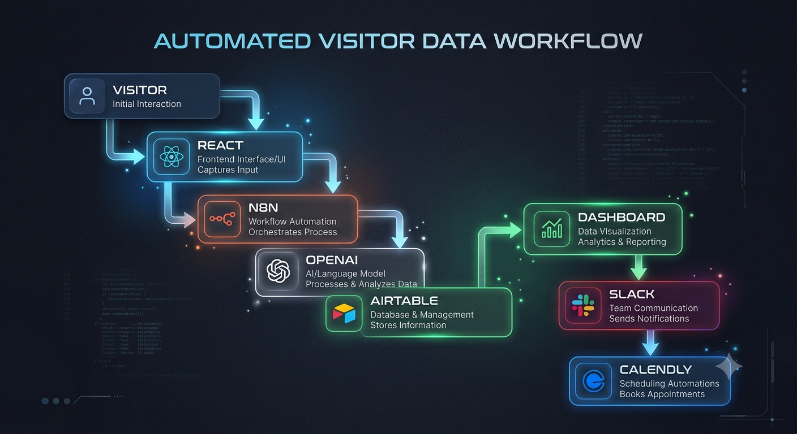
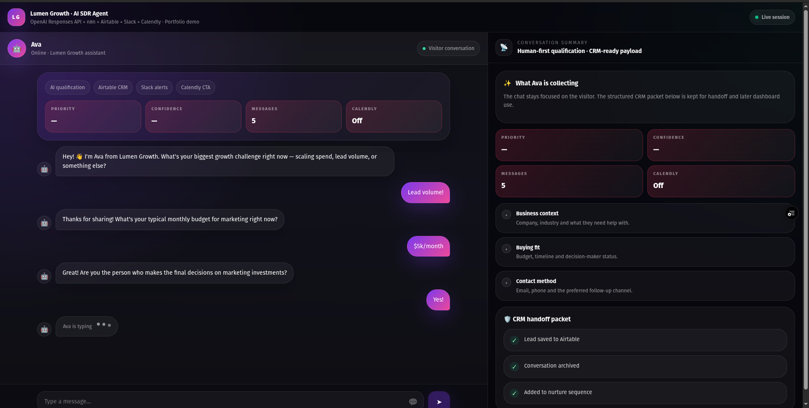
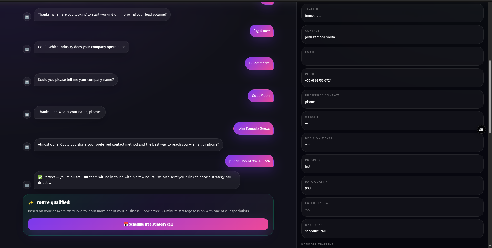
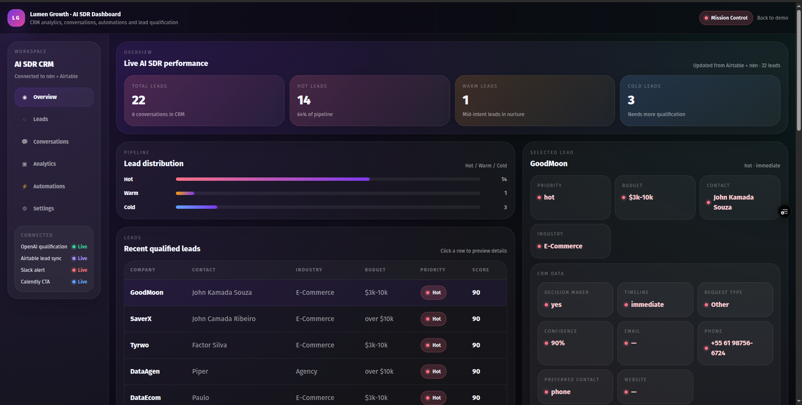
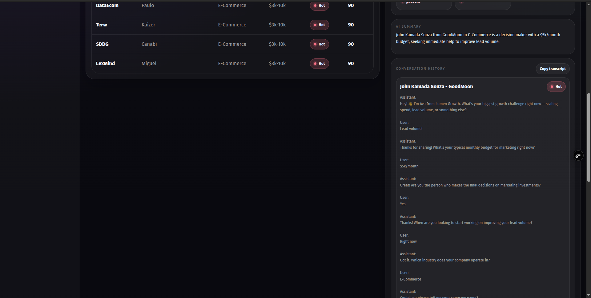
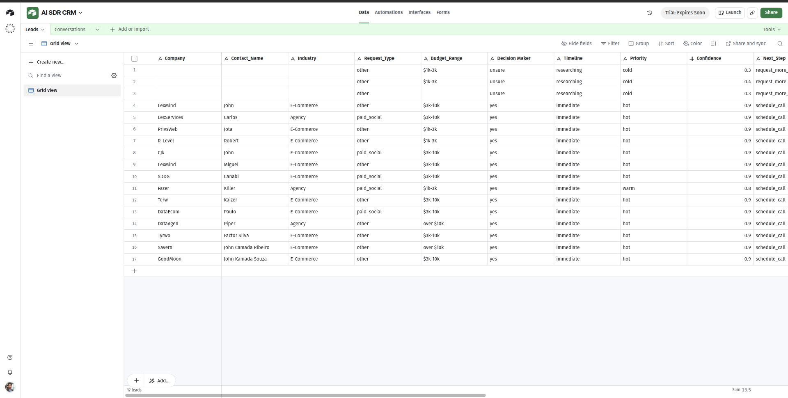
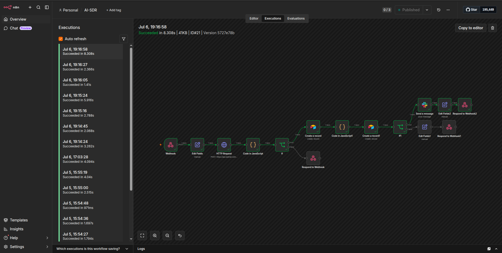
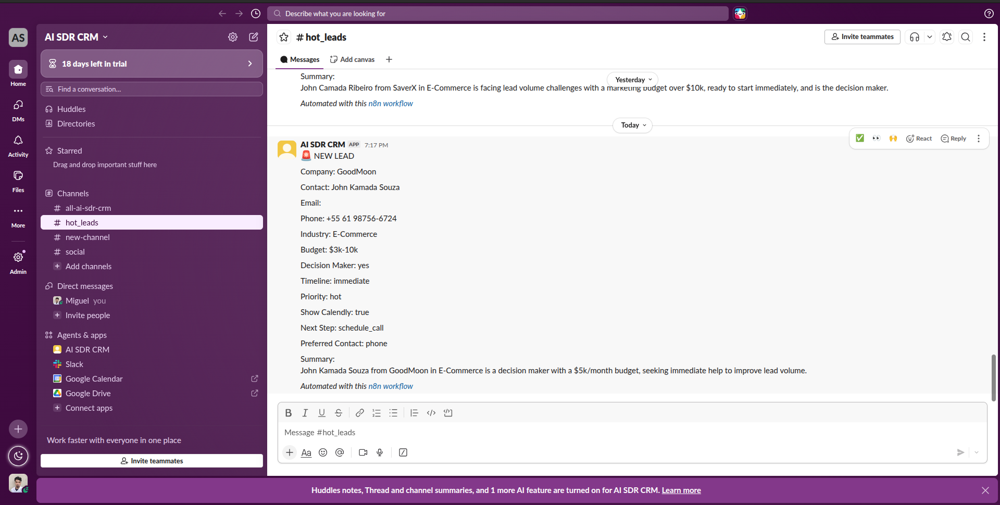

# AI SDR — Lead Qualification Agent

AI SDR is an AI-powered lead qualification platform for marketing and growth teams. It turns a visitor conversation into structured CRM data, notifies sales in real time, and presents a booking CTA for high-intent leads.

## What it does

- Qualifies visitors through a natural chat experience.
- Captures CRM data such as company, contact, industry, budget, decision maker, timeline, and contact method.
- Stores leads and conversation history in Airtable.
- Sends hot leads to Slack instantly.
- Displays a Calendly CTA for qualified leads.
- Powers an internal dashboard for lead analytics and conversation review.

## Live flow

`Visitor → React Chat → n8n → Airtable → Slack → Calendly → Dashboard`

## Features

- AI-powered qualification
- Persistent conversation history
- Hot / warm / cold lead classification
- Structured CRM storage
- Real-time Slack alerts
- Calendly booking CTA
- Live dashboard for lead review
- Dark SaaS-style UI

## Tech stack

**Frontend**
- React
- Vite
- JavaScript / JSX

**Automation + data**
- n8n
- OpenAI Responses API
- Airtable
- Slack
- Calendly

## Screenshots

### Architecture


### Chat


### Qualified lead


### Dashboard


### Lead details


### Airtable


### n8n


### Slack


## Demo video

> Add the final demo video link here.

**Video:** TBD

## How it works

1. The visitor talks to Ava, the AI SDR assistant.
2. The assistant asks one question at a time and extracts structured CRM fields.
3. n8n classifies the lead and stores the data in Airtable.
4. Hot leads trigger a Slack alert and a Calendly CTA.
5. The dashboard reads the same live data for analytics and review.

## Setup

### Prerequisites
- Node.js
- npm
- n8n
- Airtable account
- Slack app/workspace
- OpenAI API key
- Calendly account

### Environment variables

```bash
VITE_N8N_WEBHOOK_URL=http://localhost:5678/webhook
VITE_N8N_DASHBOARD_URL=http://localhost:5678/webhook/dashboard
OPENAI_API_KEY=your_openai_api_key
AIRTABLE_API_KEY=your_airtable_pat
AIRTABLE_BASE_ID=your_airtable_base_id
SLACK_BOT_TOKEN=your_slack_bot_token
CALENDLY_URL=https://calendly.com/your-booking-link
```

## Run locally

```bash
cd frontend
npm install
npm run dev
```

Then run your n8n instance and import the workflow JSON.

## Deploy

Recommended stack:

- **Frontend:** Vercel
- **Automation:** n8n
- **CRM:** Airtable
- **Notifications:** Slack
- **Scheduling:** Calendly

## Repository structure

```text
assets/
  screenshots/
frontend/
n8n_data/
prompts/
docker-compose.yml
README.md
```

## Notes

- The dashboard is connected to live workflow data.
- Conversation history is separated from structured CRM fields.
- The UI is intentionally designed to feel like a real SaaS product.

## License

This project is intended for portfolio and freelance demonstrations.